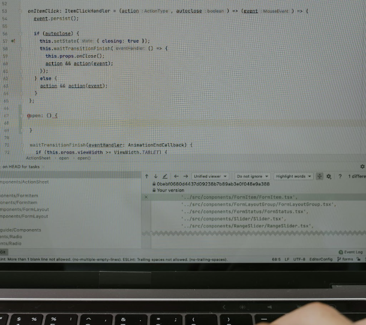

# Welcome to Gachon University's "Software Engineering Lab"

{: .center width="600"}

Our lab strives for academic excellence and social contribution through research in these areas.

## Research Areas

### Software

{: .center width="200"}

Centered on Software Academy, Software Engineering, and Enterprise Programming, we are deeply engaged in developing innovative software solutions using Spring and Backend Technologies.

### Cloud Computing

{: .center width="200"}

We are focused on researching Cloud Native Solutions using Kubernetes, Docker, ELK Stack, exploring new possibilities in the field of cloud computing.

### Healthcare Software

{: .center width="200"}

Our research in AI applications using medical data and standards like HL7 and FHIR aims to enhance the quality of medical services and develop innovative healthcare solutions.